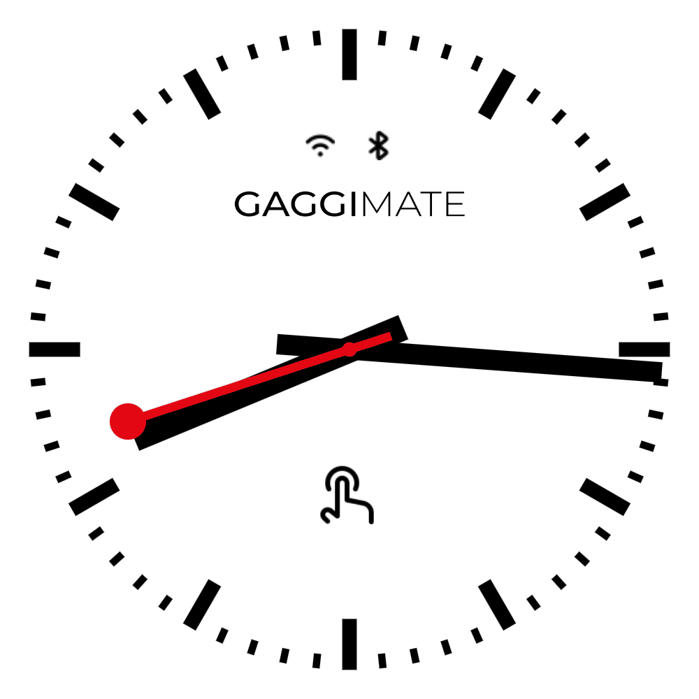

<p align="center">

</p>

This branch adds a analog clock to the standby display.

## Features

- **Standby Clock**: Renders a SBB-like clock as standby display.


## How to merge

```
cd <gaggimate>
git remote add second_fork https://github.com/tobiasguyer/gaggimate.git 
git fetch second_fork
git checkout master
git merge second_fork/clock

```


## How to flash
Easiest way to flash the Repo is with Visual Studio Code and platformio extension.\
Open the folder in VSCode and choose the environement env:display(bottom menu).\
Build and upload the code and your new kitchen clock is runnning :)