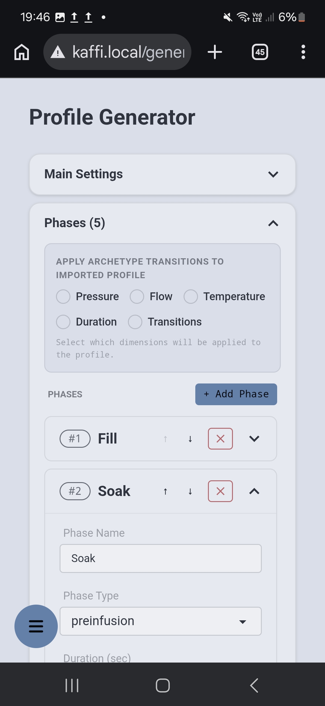
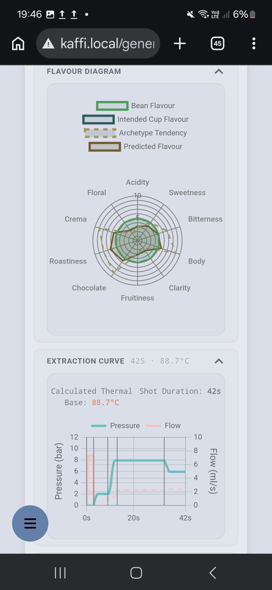

This branch adds a new webpage to the gaggimate web interface

## Features

- **Generate Profiles** based on predefined Archetypes
- **Adapt Profiles** based on defined parameter like intended flavour, roast params etc.
- **Simple Layout for Profiles**
- **Change Pressure and Flow** directly in the Extraction Curve Layout
- **Let AI adapt your propfiles** you can get a free subscription on HuggingFace.co

## Preview




## How to merge

```
cd <gaggimate>
git remote add second_fork https://github.com/tobiasguyer/gaggimate.git 
git fetch second_fork
git checkout master
git merge second_fork/generator
```


## How to flash
Easiest way to flash the Repo is with Visual Studio Code and platformio extension.\
Open the folder in VSCode and choose the environement env:display(bottom menu).\
Open up a new terminal in VSCode.
```
cd web
npm install chartjs-plugin-dragdata
npm run build
mkdir -p ../data/w
rm -rf ../data/w/*
cp -r dist/* ../data/w/
```

Run ``npm run preview`` if you want to see a local hosted preview.\
In VSCode you can select the PlattformIO Extension in the Navigation Bar.\
Click "Build Filesystem Image" and "Upload Filesystem Image" in  ``Project Tasks`` to reflash the filesystem with the current web-pages